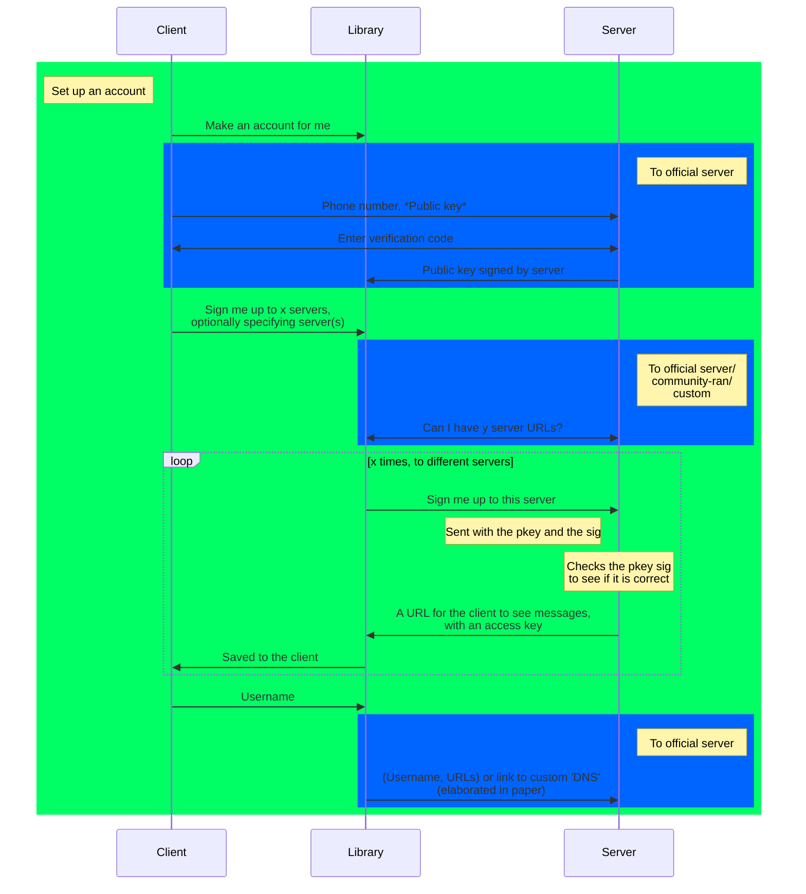
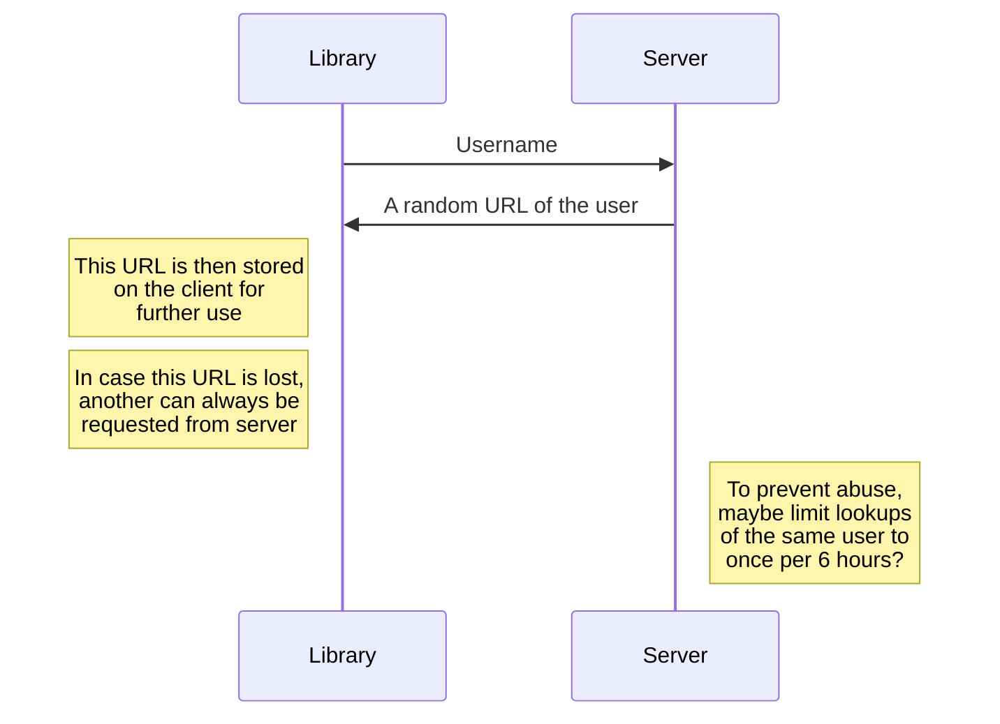

# paper

## Name

Officially `superlongnamehardtotypeanditscaresusers`, but you can call it `dispatch-d`.

## Setting up an account

## A custom 'DNS' for users

@thisiscoding1234 dubbs it 'ULS' (Username Lookup System).

