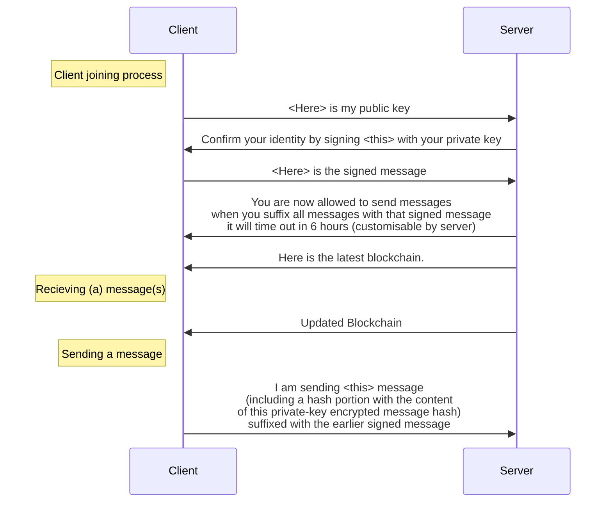

# paper

## Name

`dispatch-d` (Dispatch - decentralised).

## Basic principles
- all accounts are password-less, instead based on an RSA keypair
- accounts are solely identified by a hash of their public key, rather than a username
- all messages are encrypted by a Diffie-Hellman key exchange
- all messages contain a "hash" signature, which is a hash of the message, encrypted with the sender's private key
- all messages are added to a blockchain of messages, held in the server but available to all clients with authorisation to view the server.

---

- all servers are run by communities, which have config files, for example an allowlist, a blockchain. 

## Messaging

- to join a server, the owner must configure the allowlist to include your public key

## How will this work in practice?
- the server will probably be written in either Rust, Flask, or Node.js.
- to achieve duplex or duplex-like communication, our options include WebSockets, long-polling, or server-sent events.
- the client will be a javascript library - the frontend will be nothing special, just a simple chat app interfacing with the library which does the heavy lifting.